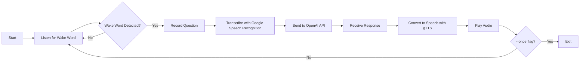

# Voice Assistant Training Demo

<div align="center">

[](https://www.python.org/downloads/)
[](https://opensource.org/licenses/MIT)
[](https://github.com/astral-sh/ruff)
[](https://github.com/astral-sh/uv)

A microphone-driven assistant that listens for a configurable wake word, records a spoken question, and uses the OpenAI API to produce and read an answer aloud.

**Built with [`uv`](https://github.com/astral-sh/uv) for fast, reliable Python dependency management.**

[Features](#features) •
[Quick Start](#quick-start) •
[Installation](#installation) •
[Usage](#usage) •
[Configuration](#configuration)

</div>

---

## Table of Contents

- [Overview](#overview)
- [Features](#features)
- [Quick Start](#quick-start)
- [Project Structure](#project-structure)
- [Prerequisites](#prerequisites)
- [Installation](#installation)
  - [Installing PortAudio](#installing-portaudio)
  - [Setting Up with uv](#setting-up-with-uv)
  - [Alternative: Setting Up with pip](#alternative-setting-up-with-pip)
- [Configuration](#configuration)
- [Usage](#usage)
  - [Basic Usage](#basic-usage)
  - [Command Line Options](#command-line-options)
  - [Examples](#examples)
  - [Using as a Python Package](#using-as-a-python-package)
- [How It Works](#how-it-works)
- [Testing](#testing)
- [Troubleshooting](#troubleshooting)
- [Contributing](#contributing)
- [License](#license)
- [Acknowledgments](#acknowledgments)

## Overview

This repository provides a lightweight voice assistant demo built with Python and managed with [`uv`](https://github.com/astral-sh/uv). It's intentionally simple and well-documented, making it ideal as training material for exploring:

- **Speech Recognition**: Convert spoken words to text using Google's Speech Recognition API
- **Text-to-Speech**: Generate natural-sounding audio responses with Google Text-to-Speech (gTTS)
- **Large Language Models**: Integrate OpenAI's GPT models for intelligent conversational responses
- **Audio Processing**: Handle microphone input and audio playback with pygame
- **Modern Python Tooling**: Experience `uv` for lightning-fast dependency management

Perfect for workshops, demonstrations, and learning how to build voice-enabled applications with modern Python tooling.

## Project Structure

This project follows Python packaging best practices with a clean `src/` layout:

```
voice-assistant-demo/
├── src/
│   └── voice_assistant/          # Main package
│       ├── __init__.py           # Package exports
│       ├── __main__.py           # Entry point for 'python -m voice_assistant'
│       ├── assistant.py          # VoiceAssistant class
│       ├── cli.py                # Command-line interface
│       └── config.py             # Configuration dataclass
├── tests/                        # Test suite (44 tests, 79% coverage)
│   ├── conftest.py              # Shared fixtures
│   ├── test_assistant.py        # Assistant tests
│   ├── test_cli.py              # CLI tests
│   ├── test_config.py           # Config tests
│   └── test_integration.py      # Integration tests
├── pyproject.toml               # Project metadata and dependencies
├── uv.lock                      # Locked dependencies for reproducibility
├── .python-version              # Python version for UV
└── README.md                    # This file
```

**Benefits of this structure:**
- ✅ Clean separation of concerns (assistant, CLI, config)
- ✅ Installable as a proper Python package
- ✅ Can be imported and used programmatically
- ✅ Standard `src/` layout prevents accidental imports
- ✅ Easy to navigate and extend

## Features

✨ **Core Functionality**

- 🎤 Automatic noise calibration and wake-word detection
- 🗣️ Google Speech Recognition transcription of recorded audio
- 🤖 Configurable OpenAI Chat Completions integration (model, temperature, token limits, etc.)
- 🔊 Text-to-speech responses delivered through gTTS and played with pygame
- ⚙️ Extensive command line options for customization

🛠️ **Developer-Friendly**

- ⚡ **Lightning-fast dependency management with `uv`**
- 🔒 Reproducible builds with `uv.lock` lockfile
- 📦 Clean, well-documented codebase designed for learning
- 🏷️ Type hints throughout for better IDE support
- 🐛 Configurable logging levels for debugging

## Quick Start

Get up and running in under a minute with `uv`:

```bash
# Install uv (if not already installed)
curl -LsSf https://astral.sh/uv/install.sh | sh

# Clone the repository
git clone https://github.com/yourusername/voice-assistant-demo.git
cd voice-assistant-demo

# Install dependencies (creates .venv automatically)
uv sync

# Set your OpenAI API key
export OPENAI_API_KEY="sk-your-api-key-here"

# Run the assistant
uv run voice-assistant
```

> **Note**: PortAudio must be installed first (see [Installing PortAudio](#installing-portaudio))

## Prerequisites

Before you begin, ensure you have the following:

- **Python 3.9 or newer** - [Download Python](https://www.python.org/downloads/) (or let `uv` manage it for you!)
- **Working microphone** - Connected to the machine running the demo
- **OpenAI API key** - [Get your API key](https://platform.openai.com/api-keys) with access to the selected chat model
- **PortAudio libraries** - Required by `PyAudio` for audio input/output
- **`uv` (recommended)** - [Install uv](https://docs.astral.sh/uv/getting-started/installation/) for best experience

## Installation

### Installing PortAudio

PortAudio must be installed before setting up the Python dependencies:

| Platform | Installation Command |
|----------|---------------------|
| **macOS** | `brew install portaudio` |
| **Ubuntu/Debian** | `sudo apt-get install portaudio19-dev` |
| **Windows** | Download [PortAudio binaries](http://www.portaudio.com/download.html) and ensure they're on your system `PATH` |

> **Windows Users**: You may also need [Visual C++ Build Tools](https://visualstudio.microsoft.com/visual-cpp-build-tools/) for compiling PyAudio.

### Setting Up with uv

**`uv` is the recommended way to manage this project.** It's an extremely fast Python package installer and resolver, written in Rust.

#### Why uv?

- ⚡ **10-100x faster** than `pip` and `pip-tools`
- 🔒 **Reproducible** - `uv.lock` ensures everyone gets the same dependencies
- 🐍 **Python version management** - `uv` can install and manage Python versions for you
- 🎯 **Drop-in replacement** - Works with standard `pyproject.toml`

#### Installation Steps

1. **Install uv**:

   ```bash
   # macOS/Linux
   curl -LsSf https://astral.sh/uv/install.sh | sh
   
   # Windows
   powershell -c "irm https://astral.sh/uv/install.ps1 | iex"
   
   # Or with pip
   pip install uv
   ```

   See the [official installation instructions](https://docs.astral.sh/uv/getting-started/installation/) for more options.

2. **Bootstrap the project**:

   ```bash
   uv sync
   ```

   This command:
   - Reads `pyproject.toml` and `uv.lock`
   - Creates a `.venv/` virtual environment (if it doesn't exist)
   - Installs all runtime and development dependencies
   - Ensures reproducible builds across all machines

3. **Running commands**:

   You have two options:

   **Option A: Use `uv run` (recommended)**
   ```bash
   uv run voice-assistant
   uv run python chatbot.py --help
   uv run pytest  # for testing
   ```

   **Option B: Activate the virtual environment**
   ```bash
   source .venv/bin/activate  # macOS/Linux
   .venv\Scripts\activate      # Windows
   
   # Then run commands normally
   voice-assistant
   python chatbot.py --help
   ```

#### Updating Dependencies

```bash
# Update all dependencies to latest compatible versions
uv lock --upgrade

# Sync the environment after updating
uv sync
```

### Alternative: Setting Up with pip

If you prefer traditional Python tooling (though `uv` is strongly recommended):

1. **Clone the repository**:

   ```bash
   git clone https://github.com/yourusername/voice-assistant-demo.git
   cd voice-assistant-demo
   ```

2. **Create a virtual environment**:

   ```bash
   python -m venv .venv
   source .venv/bin/activate  # macOS/Linux
   .venv\Scripts\activate      # Windows
   ```

3. **Install dependencies**:

   ```bash
   pip install -e .
   ```

   This installs the project and its dependencies from `pyproject.toml`.

## Configuration

### OpenAI API Key

Set your OpenAI API key as an environment variable:

```bash
# macOS/Linux
export OPENAI_API_KEY="sk-your-api-key-here"

# Windows (Command Prompt)
set OPENAI_API_KEY=sk-your-api-key-here

# Windows (PowerShell)
$env:OPENAI_API_KEY="sk-your-api-key-here"
```

> **Security Note**: Environment variables are preferred over hardcoding credentials in source files, especially for training and demonstration purposes.

Alternatively, you can pass the API key directly via the `--api-key` command line argument.

## Usage

### Basic Usage

After activating your virtual environment and setting the API key:

```bash
python chatbot.py
```

Or with `uv` (no activation needed):

```bash
uv run python chatbot.py
```

Or using the installed script:

```bash
uv run voice-assistant
```

**How to interact:**

1. The assistant will start listening for the wake word (default: `"genius"`)
2. Say the wake word clearly into your microphone
3. After detection, speak your question
4. The assistant will process your question, query OpenAI, and speak the response

Press `Ctrl+C` to exit at any time.

### Command Line Options

Customize the assistant's behavior with these options:

```bash
python chatbot.py [OPTIONS]
```

| Option | Description | Default |
|--------|-------------|---------|
| `--keyword TEXT` | Wake word that activates recording | `genius` |
| `--api-key TEXT` | OpenAI API key (overrides environment variable) | `$OPENAI_API_KEY` |
| `--model TEXT` | OpenAI chat model to use | `gpt-3.5-turbo` |
| `--temperature FLOAT` | Sampling temperature (0.0-2.0) | `0.7` |
| `--max-output-tokens INT` | Maximum tokens in the response | `400` |
| `--listen-timeout FLOAT` | Seconds to wait for speech before timeout | None |
| `--phrase-time-limit FLOAT` | Max seconds to record once speech starts | None |
| `--ambient-noise-duration FLOAT` | Seconds to sample background noise | `0.5` |
| `--pause-threshold FLOAT` | Seconds of silence to mark end of phrase | `0.8` |
| `--once` | Exit after answering a single question | False |
| `--log-level LEVEL` | Logging verbosity (`DEBUG`, `INFO`, `WARNING`, `ERROR`, `CRITICAL`) | `INFO` |

View all options:

```bash
python chatbot.py --help
```

### Examples

**Use a different wake word:**
```bash
uv run voice-assistant --keyword "hello"
```

**Use GPT-4 with higher creativity:**
```bash
uv run voice-assistant --model gpt-4o --temperature 1.2
```

**Demo mode (single question, then exit):**
```bash
uv run voice-assistant --once --log-level DEBUG
```

**Adjust for noisy environments:**
```bash
uv run voice-assistant --ambient-noise-duration 2.0 --pause-threshold 1.2
```

**Run as a Python module:**
```bash
uv run python -m voice_assistant --keyword "hello"
```

### Using as a Python Package

The voice assistant can also be imported and used programmatically in your own Python code:

```python
from voice_assistant import VoiceAssistant, AssistantConfig

# Create custom configuration
config = AssistantConfig(
    keyword="computer",
    model="gpt-4o",
    temperature=0.9,
    max_output_tokens=500
)

# Initialize the assistant
assistant = VoiceAssistant(
    api_key="sk-your-key-here",
    config=config
)

# Run in one-shot mode
assistant.run(once=True)

# Or generate responses directly
response = assistant.generate_response("What is Python?")
print(response)

# Convert text to speech
assistant.speak_text("Hello, world!")
```

**Package Exports:**

```python
from voice_assistant import (
    VoiceAssistant,      # Main assistant class
    AssistantConfig,     # Configuration dataclass
    __version__,         # Package version
)

from voice_assistant.cli import (
    parse_args,          # CLI argument parser
    configure_logging,   # Logging setup
    main,               # Main entry point
)
```

## How It Works



1. **Wake Word Detection**: The assistant continuously listens and transcribes audio until it hears the configured keyword
2. **Question Capture**: After wake word detection, it records the user's spoken question
3. **Speech-to-Text**: Google's Speech Recognition API transcribes the audio
4. **AI Processing**: The transcribed text is sent to OpenAI's Chat Completions API
5. **Text-to-Speech**: The response is converted to audio using gTTS
6. **Playback**: The generated audio file is played through the system's default audio player

## Testing

This project includes a comprehensive test suite to ensure reliability and facilitate contributions.

### Running Tests

Run all tests with pytest:

```bash
# Run all tests
uv run pytest

# Run with verbose output
uv run pytest -v

# Run with coverage report
uv run pytest --cov=chatbot --cov-report=term-missing

# Run specific test file
uv run pytest tests/test_assistant.py

# Run specific test
uv run pytest tests/test_assistant.py::TestGenerateResponse::test_generate_response_success
```

### Test Structure

```
tests/
├── __init__.py              # Package marker
├── conftest.py             # Shared fixtures and test configuration
├── test_config.py          # Tests for AssistantConfig dataclass (3 tests)
├── test_assistant.py       # Tests for VoiceAssistant class (18 tests)
├── test_cli.py             # Tests for command-line interface (13 tests)
└── test_integration.py     # Integration tests for workflows (7 tests)
```

Coverage by module:
```
Module                          Stmts   Miss  Cover
--------------------------------------------------
src/voice_assistant/__init__.py     4      0   100%
src/voice_assistant/assistant.py  125     27    78%
src/voice_assistant/cli.py         32      7    78%
src/voice_assistant/config.py      13      0   100%
--------------------------------------------------
TOTAL                             178     38    79%
```

### Test Coverage

The test suite currently achieves **79% code coverage** and includes:

- ✅ **18 tests** for VoiceAssistant class functionality
- ✅ **13 tests** for CLI argument parsing and configuration  
- ✅ **3 tests** for configuration dataclass
- ✅ **7 integration tests** for complete workflows
- ✅ **Mock fixtures** for external dependencies (OpenAI, microphone, audio)

### Key Testing Features

**Mocked Dependencies**: Tests use mocks for:
- OpenAI API calls (no real API requests)
- Microphone input (no actual audio recording)
- Speech recognition (deterministic results)
- Audio playback (no sound during tests)

**Fast Execution**: Full test suite runs in under 1 second

**Fixtures**: Reusable test fixtures in `conftest.py`:
```python
mock_recognizer       # Mock speech recognizer
mock_openai_client    # Mock OpenAI client
assistant_config      # Default configuration
voice_assistant       # Fully configured assistant
```

### Writing New Tests

To add new tests:

1. Create or update test files in `tests/`
2. Use existing fixtures from `conftest.py`
3. Follow the naming convention `test_*.py` for files and `test_*` for functions
4. Run tests to ensure they pass

Example test:

```python
def test_my_feature(voice_assistant, mock_openai_client):
    """Test description."""
    voice_assistant.client = mock_openai_client
    
    result = voice_assistant.my_method("input")
    
    assert result == "expected_output"
```

### Continuous Integration

To run tests automatically on commit, add a pre-commit hook:

```bash
# .git/hooks/pre-commit
#!/bin/sh
uv run pytest || exit 1
```

## Troubleshooting

### `pyaudio` fails to install

**Problem**: PyAudio installation errors during `pip install` or `uv sync`.

**Solution**: 
- Ensure PortAudio is installed (see [Installing PortAudio](#installing-portaudio))
- On Windows, install [Visual C++ Build Tools](https://visualstudio.microsoft.com/visual-cpp-build-tools/)
- Try upgrading pip: `pip install --upgrade pip setuptools wheel`

### Wake word not detected

**Problem**: The assistant doesn't respond when you say the wake word.

**Solution**:
- Speak clearly and at normal volume
- Increase calibration time: `--ambient-noise-duration 2.0`
- Reduce background noise in your environment
- Try a different wake word that's more distinct: `--keyword "computer"`
- Increase logging to debug: `--log-level DEBUG`

### No response from OpenAI

**Problem**: The assistant hangs or errors when generating a response.

**Solution**:
- Verify your API key is correct: `echo $OPENAI_API_KEY`
- Check that your OpenAI account has API credits
- Ensure you have access to the requested model
- Verify network connectivity
- Check OpenAI status: https://status.openai.com/

### Audio playback issues

**Problem**: Response is generated but not played aloud.

**Solution**:
- Ensure your system has working audio output
- Check system volume and audio settings
- `pygame` mixer may need audio backend configuration on some Linux systems
- On headless systems, audio playback won't work (use in environments with audio output)

### Microphone not found

**Problem**: `OSError: Microphone is not available`

**Solution**:
- Ensure a microphone is connected and not in use by other applications
- Grant microphone permissions to your terminal/Python on macOS/Windows
- List available devices: 
  ```python
  import speech_recognition as sr
  print(sr.Microphone.list_microphone_names())
  ```

## Contributing

Contributions are welcome! This codebase is intentionally small so it can be modified during workshops.

### Ways to Contribute

- 🐛 Report bugs and issues
- 💡 Suggest new features or improvements
- 📖 Improve documentation and examples
- 🧪 Add tests for better coverage
- ✨ Submit pull requests with enhancements

### Development Setup

1. Fork the repository
2. Clone your fork: `git clone https://github.com/yourusername/voice-assistant-demo.git`
3. Install with dev dependencies: 
   ```bash
   uv sync  # Installs runtime + dev dependencies
   ```
4. Create a branch: `git checkout -b feature/your-feature-name`
5. Make your changes
6. Run linter: 
   ```bash
   uv run ruff check .
   uv run ruff format .
   ```
7. Run tests and ensure they pass:
   ```bash
   uv run pytest -v
   uv run pytest --cov=chatbot  # Check coverage
   ```
8. Add tests for new features
9. Commit and push your changes
10. Open a pull request

### Contribution Guidelines

- Keep changes focused and well-documented
- Maintain the educational nature of the codebase
- Add comments for complex logic
- Write tests for new features (aim for >75% coverage)
- Update README if adding new features or options
- Follow existing code style (enforced by `ruff`)
- Ensure all tests pass before submitting PR

For major changes, please open an issue first to discuss what you would like to change.

## License

This project is licensed under the MIT License - see the [LICENSE](LICENSE) file for details.

```
MIT License

Copyright (c) 2025 Voice Assistant Maintainers

Permission is hereby granted, free of charge, to any person obtaining a copy
of this software and associated documentation files (the "Software"), to deal
in the Software without restriction, including without limitation the rights
to use, copy, modify, merge, publish, distribute, sublicense, and/or sell
copies of the Software, and to permit persons to whom the Software is
furnished to do so, subject to the following conditions:

The above copyright notice and this permission notice shall be included in all
copies or substantial portions of the Software.

THE SOFTWARE IS PROVIDED "AS IS", WITHOUT WARRANTY OF ANY KIND, EXPRESS OR
IMPLIED, INCLUDING BUT NOT LIMITED TO THE WARRANTIES OF MERCHANTABILITY,
FITNESS FOR A PARTICULAR PURPOSE AND NONINFRINGEMENT. IN NO EVENT SHALL THE
AUTHORS OR COPYRIGHT HOLDERS BE LIABLE FOR ANY CLAIM, DAMAGES OR OTHER
LIABILITY, WHETHER IN AN ACTION OF CONTRACT, TORT OR OTHERWISE, ARISING FROM,
OUT OF OR IN CONNECTION WITH THE SOFTWARE OR THE USE OR OTHER DEALINGS IN THE
SOFTWARE.
```

## Acknowledgments

This project leverages several excellent open-source libraries:

- **[uv](https://github.com/astral-sh/uv)** - An extremely fast Python package installer and resolver (primary dependency manager)
- **[OpenAI Python SDK](https://github.com/openai/openai-python)** - Official Python library for the OpenAI API
- **[SpeechRecognition](https://github.com/Uberi/speech_recognition)** - Library for performing speech recognition with support for multiple engines
- **[gTTS](https://github.com/pndurette/gTTS)** - Google Text-to-Speech API wrapper
- **[pygame](https://www.pygame.org/)** - Cross-platform library for audio playback
- **[PyAudio](http://people.csail.mit.edu/hubert/pyaudio/)** - Python bindings for PortAudio
- **[Ruff](https://github.com/astral-sh/ruff)** - An extremely fast Python linter and formatter

Special thanks to the Astral team for creating `uv` and `ruff`, and to all contributors and workshop participants who have helped improve this project.

---

<div align="center">

**[⬆ Back to Top](#voice-assistant-training-demo)**

Made with ❤️ for learning and exploration

</div>
